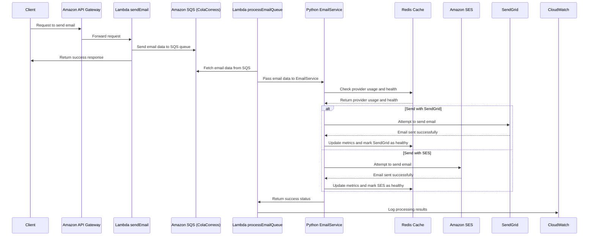
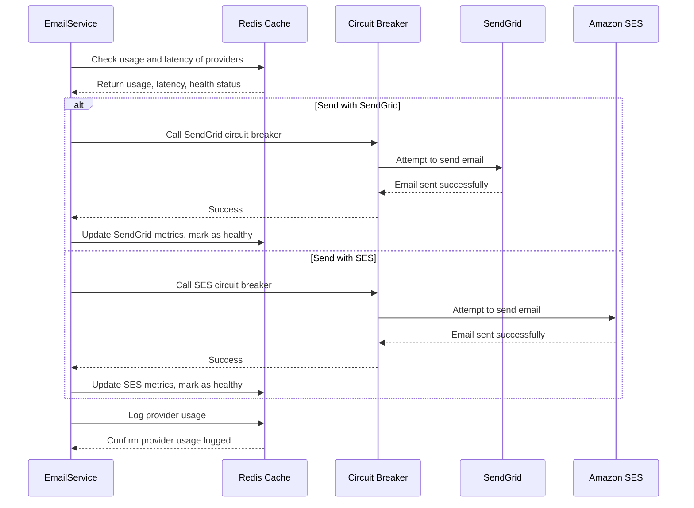

# Email Service Project

## Overview

The main goal of this project is to build a robust, scalable, and efficient email service that can dynamically switch between email providers in the case of failure or latency degradation. We aim to create a service that offers high availability, ensuring minimal impact on users during provider outages or high-latency situations. This system uses **Amazon SES**, **SendGrid**, and AWS services to provide an abstraction layer between email providers, allowing the system to switch providers quickly without affecting the user experience.

### Key Features

- **Provider Switching**: If one email provider (e.g., SendGrid) fails or experiences high latency, the system automatically switches to another provider (e.g., Amazon SES) to ensure the email is sent.
- **Circuit Breaker**: Each provider is monitored with a circuit breaker pattern, ensuring that if a provider is unhealthy, the system stops attempting to use it until it's restored.
- **Provider Health Monitoring**: Latency, usage, and health metrics are tracked using **Redis** to make informed decisions about which provider to use.
- **Scalability**: The architecture is designed to scale as the load increases, taking advantage of AWS services such as **SQS**, **Lambda**, and **API Gateway** to handle increased traffic.

---

## Architecture

Below is the image representing the architectural design of the project:

### Explanation of the Architecture

The architecture consists of several key AWS components, each playing a specific role in the system:

1. **Amazon API Gateway**: 
   - This is the entry point for the client. When a request is made to send an email, the API Gateway forwards the request to the `sendEmail` Lambda function.

2. **sendEmail Lambda Function**:
   - This function receives the request from the API Gateway and enqueues the email data into **Amazon SQS (ColaCorreos)**. After enqueuing, it immediately responds to the client with a success message.

3. **Amazon SQS (ColaCorreos)**:
   - This acts as a message queue that holds the email data temporarily. It's designed to handle large volumes of email requests, ensuring that each email is processed asynchronously by the `processEmailQueue` Lambda function.

4. **processEmailQueue Lambda Function**:
   - This function fetches the email data from the SQS queue and processes it using the **EmailService** logic. It checks the health and latency metrics of both **Amazon SES** and **SendGrid** using **Redis** and decides which provider to use to send the email.

5. **Redis (ElastiCache)**:
   - Redis acts as a cache and database for tracking the health, latency, and usage of each email provider. It helps in making real-time decisions on which provider to use based on current conditions.

6. **Email Providers (SendGrid and Amazon SES)**:
   - The system interacts with both **SendGrid** and **Amazon SES** to send emails. If one provider fails, the system switches to the other provider seamlessly. 
   - The **Circuit Breaker** pattern is implemented here to monitor the health of each provider and avoid continuous use of an unhealthy provider.

7. **Amazon CloudWatch Logs**:
   - Logs from both the `sendEmail` and `processEmailQueue` Lambda functions are stored here, providing insight into email processing, errors, and provider performance.

8. **Amazon S3**:
   - This is used to store configurations, logs, or other necessary files related to the email service, ensuring durability and high availability.

By combining these AWS services, we have built a resilient system that can handle high loads, minimize downtime, and ensure that emails are delivered efficiently, regardless of provider outages or latency issues.

---

## General sequence diagram

### Sequence Diagram Explanation

This sequence diagram represents the flow of an email request through a serverless architecture, detailing the interactions between the client, AWS services, and external email providers.

1. **Client Request**:
   - The client sends a request to send an email, which is received by the **Amazon API Gateway**.

2. **Forwarding to Lambda**:
   - The **API Gateway** forwards the email request to the **Lambda function sendEmail**.

3. **Queueing the Email**:
   - The **sendEmail** function processes the request and places the email data into **Amazon SQS (ColaCorreos)**, a message queue.
   - After the message is queued, **sendEmail** sends a success response back to the **Client**, indicating that the request was processed successfully.

4. **Processing the Queue**:
   - The **Lambda function processEmailQueue** retrieves the email data from **SQS**.
   - This email data is then passed to the **Python EmailService**, which handles the email dispatch logic.

5. **Provider Selection and Health Check**:
   - The **EmailService** interacts with **Redis** to check the usage history and health status of the available email providers (e.g., SendGrid and Amazon SES).
   - **Redis** returns the usage and health information to help determine which provider to use.

6. **Sending the Email**:
   - The **EmailService** attempts to send the email using one of the two providers:
     - **SendGrid**: If chosen, the email is sent via **SendGrid**, and success is confirmed. The metrics for **SendGrid** are updated in **Redis**, and the provider is marked as healthy.
     - **Amazon SES**: Alternatively, if **SES** is chosen, the email is sent via **SES**, and the success is logged in the same way as **SendGrid**.

7. **Logging the Result**:
   - After the email is successfully sent, the **EmailService** returns a success status to **processEmailQueue**.
   - The **processEmailQueue** function then logs the results of the email processing in **Amazon CloudWatch** for monitoring and diagnostics.

This architecture ensures that if one email provider fails, the system can quickly switch to the other provider without affecting the user experience. The use of Redis to track provider health and usage ensures that the system selects the optimal provider based on performance and reliability metrics.

## Failover Logic

### Explanation of the Email Service Logic

This is the core logic of an Email Service that abstracts the complexity of choosing between two email providers, SendGrid and Amazon SES, guaranteeing reliability, scalability and performance. How the service works is explained below:

---

#### **Email Service Design**

This service is designed to handle email sending through multiple providers while ensuring high availability, performance optimization, and error resilience. The key aspects of the service are:

1. **Provider Selection Based on Latency and Usage**: 
   - The `EmailService` class chooses the best provider based on usage and latency metrics. This ensures that the service does not overwhelm a single provider, thus distributing the load efficiently.
   - It uses **Redis** as a caching layer to store usage, health, and latency data, which helps the system make quick decisions based on real-time information.

2. **Circuit Breakers for Resilience**:
   - Each provider has an associated **circuit breaker** (via the `pybreaker` library). Circuit breakers prevent the system from repeatedly trying a failing provider, enhancing the robustness of the solution.
   - If a provider is marked as unhealthy (due to a failure or high latency), the system switches to a healthy provider, ensuring continued email service with minimal disruption.

3. **Latency and Health Tracking**:
   - Latency thresholds are used to monitor the performance of each provider. If a provider's latency exceeds the threshold, it's marked as unhealthy.
   - **Redis** stores the latency history and tracks the health of each provider. This real-time monitoring helps the system avoid using underperforming providers.
   - This feature ensures that the system selects the provider that can offer the best response time at any given moment.

4. **Dynamic Provider Switching**:
   - If the primary provider fails or becomes overloaded, the system dynamically switches to the next healthy provider without interrupting the service.
   - The function `get_next_healthy_provider()` efficiently switches between providers based on health checks, adding resilience to the service.

---

#### **Advantages and Key Features**

1. **Robustness**: 
   - The service incorporates robust error-handling mechanisms. Whether it's an issue with a provider's API or network delays, the system can gracefully handle these errors by retrying with other providers.
   - The use of circuit breakers prevents cascading failures, ensuring that the service remains reliable even during provider outages.

2. **Scalability**:
   - By using Redis as a centralized cache for metrics (latency, health, usage), the solution is horizontally scalable. Redis can scale across multiple servers, making the email service scalable for large volumes of email traffic.
   - The load distribution between **SendGrid** and **Amazon SES** ensures that no single provider is overwhelmed. As email traffic grows, additional providers could easily be added following the same design principles.

3. **Performance Optimization**:
   - The system continuously monitors the latency of email providers and ensures that the provider with the lowest latency is chosen for future email sends. This improves the performance by always selecting the most efficient path.
   - Metrics such as latency, email count, and health status are stored in Redis, allowing the system to make real-time, data-driven decisions for each email.

4. **High Availability**:
   - The ability to switch between providers without downtime adds to the service’s **high availability**. If one provider fails or underperforms, another provider can take over immediately, providing a seamless experience for users.
   - Providers are marked healthy/unhealthy dynamically, so only the best-performing services are used.

5. **Customizability**:
   - The service is built to be easily extendable. Additional email providers can be integrated into the same framework, and the logic can be extended to include other metrics or criteria for provider selection.
   - The thresholds for latency and maximum usage can be adjusted to meet different performance or business requirements.

6. **Error Recovery**:
   - The service incorporates detailed logging and error handling. If an error occurs during email sending, it can switch to another provider and log the error appropriately. This ensures that no emails are lost, and the service remains operational even under adverse conditions.

---

#### **Scalability and Future Enhancements**

This design can easily scale with minimal changes:

- **Provider Addition**: New email providers can be added with ease. The circuit breaker logic, Redis integration, and provider selection would remain the same, allowing for seamless expansion.
- **Additional Metrics**: Other performance indicators such as provider cost or availability in different regions could be added to make more intelligent decisions in the future.
- **Global Scaling**: As email traffic increases, Redis and the email providers can be distributed across regions, providing global scaling with low-latency access.

In summary, this **Email Service** is designed to be highly **scalable**, **reliable**, and **robust**. It ensures optimal email sending by dynamically switching between providers, leveraging real-time performance data, and using advanced error-handling techniques. This approach guarantees that emails are sent successfully, even under high load or during provider outages, making it a **production-ready** solution.
