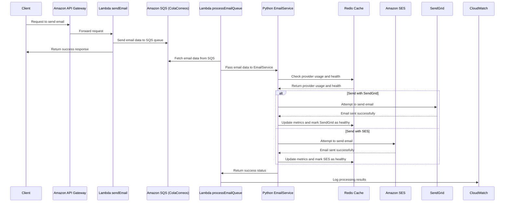

# email-service
In this repository you will find a project dedicated to optimize the workloads between two email providers, a very interesting project that mixes technologies such as serverless framework, python and redis.

## Diagrama de Secuencia

### Sequence Diagram Explanation

This sequence diagram represents the flow of an email request through a serverless architecture, detailing the interactions between the client, AWS services, and external email providers.

1. **Client Request**:
   - The client sends a request to send an email, which is received by the **Amazon API Gateway**.

2. **Forwarding to Lambda**:
   - The **API Gateway** forwards the email request to the **Lambda function sendEmail**.

3. **Queueing the Email**:
   - The **sendEmail** function processes the request and places the email data into **Amazon SQS (ColaCorreos)**, a message queue.
   - After the message is queued, **sendEmail** sends a success response back to the **Client**, indicating that the request was processed successfully.

4. **Processing the Queue**:
   - The **Lambda function processEmailQueue** retrieves the email data from **SQS**.
   - This email data is then passed to the **Python EmailService**, which handles the email dispatch logic.

5. **Provider Selection and Health Check**:
   - The **EmailService** interacts with **Redis** to check the usage history and health status of the available email providers (e.g., SendGrid and Amazon SES).
   - **Redis** returns the usage and health information to help determine which provider to use.

6. **Sending the Email**:
   - The **EmailService** attempts to send the email using one of the two providers:
     - **SendGrid**: If chosen, the email is sent via **SendGrid**, and success is confirmed. The metrics for **SendGrid** are updated in **Redis**, and the provider is marked as healthy.
     - **Amazon SES**: Alternatively, if **SES** is chosen, the email is sent via **SES**, and the success is logged in the same way as **SendGrid**.

7. **Logging the Result**:
   - After the email is successfully sent, the **EmailService** returns a success status to **processEmailQueue**.
   - The **processEmailQueue** function then logs the results of the email processing in **Amazon CloudWatch** for monitoring and diagnostics.

This architecture ensures that if one email provider fails, the system can quickly switch to the other provider without affecting the user experience. The use of Redis to track provider health and usage ensures that the system selects the optimal provider based on performance and reliability metrics.
